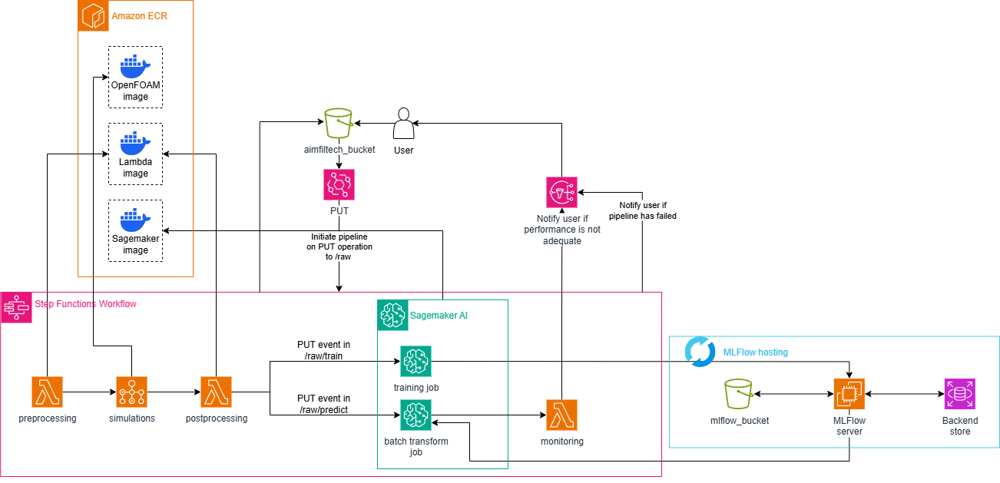

# AIMFiltech: Production-Grade CFD+ML Orchestration for Industrial Filtration Optimization

> **AIMFiltech is a cloud-native, production-ready ML platform combining OpenFOAM CFD simulation with machine learning to optimize advanced industrial filtration systems.**

## 🚀 Overview

**AIMFiltech** enables smart, AI-driven filtration by integrating sensor, IoT, CFD, and ML technologies in a scalable, secure AWS environment to support sustainable circular economy goals in industrial wastewater management.

- **Problem:** Industrial filtration processes lack real-time monitoring and predictive control, making them inefficient and costly, especially under tight environmental regulations.  
- **Solution:** Automate CFD data generation (OpenFOAM) and ML modeling to predict filtration performance, enable data-driven process control, and reduce pollutant emissions.  
- **Architecture:** AWS-native cloud deployment with end-to-end automation (preprocessing → simulation → modeling → monitoring), reproducible by design.

## 🏗 Architecture

Below is a high-level AWS architecture diagram illustrating the AIMFiltech pipeline:

This architecture covers:

- **Preprocessing:** AWS Lambda merges and cleanses sensor and process data for simulation input.  
- **Simulation:** AWS Batch runs OpenFOAM CFD jobs in parallel for throughput.  
- **Postprocessing & ML:** Lambda aggregates simulation results and triggers ML workflows that handle both training (using SageMaker) and batch predictions.  
- Continuous monitoring via Lambda checks data quality and model drift, sending alerts through SNS on drift detection.
- **Infrastructure as Code:** Modular Terraform modules deploy, audit, and destroy infrastructure.  
- **Cost Control:** AWS Budget limits spending to about $100/month.

**Technologies:** AWS Lambda, Batch, SageMaker, S3, EC2, RDS, MLflow, Docker, Terraform

## 🧠 ML Engineering

- **Task:** Multi-class classification predicting agglomeration class from physical, chemical, and CFD-derived features.  
- **Pipeline:** Processed features stored in S3; SageMaker handles loading, splitting, and training.  
- **Model:** XGBoost with hyperparameter tuning via Optuna.  
- **Metric:** F1 score used to measure performance.  
- **Experiment Tracking:** All runs, parameters, metrics, and artifacts logged in MLflow.  
- **Deployment:** Validated models promoted from staging to production.

The pipeline tracks key features, monitors performance rigorously, and ensures reproducibility with versioned models.

## 🧰 Code Quality & Practices

- Pipeline phases isolated via separate Docker images for Lambda, OpenFOAM, and ML components.  
- Basic YAML configs in `.cfg/` directory; minimal and extendable to ship product quickly.  
- Makefile commands (`make deploy`, `make destroy`) standardize deployment and teardown to save costs by shutting down infra when idle.  
- Code has some docstrings and separation of concerns but lacks linting, formatting, and tests—traded off for speed of delivery.  
- Partial CI/CD with manual infra lifecycle control to avoid always-on costs.

## 🛠 Developer Experience

- **Deploy:** `make deploy` provisions full infra; `make destroy` tears down cleanly.  
- **Local Dev:** Fully containerized environments isolate dependencies.  
- **Monitoring:** Logs available during deployment; MLflow UI shows experiment metrics and visualizations.  
- **Onboarding:** Requires Docker, Terraform, AWS credentials; deployment scripted for ease.

## 📊 Results & Benchmarks

- F1 score tracked via cross-validation; confusion matrices generated for insights.  
- AWS Batch parallelizes CFD jobs, reducing runtimes from hours to minutes.  
- Cost and runtime monitored per phase; models optimized for budget and scalability.  
- Artifacts include JSON stats from data distributions (for monitoring) and plots visualizing model performance.  
- Perfect test accuracy flagged as likely due to small holdout sets, not overclaimed.

## ⚖️ Tradeoffs & Key Decisions

- XGBoost chosen for its strong performance and flexibility.  
- AWS native integration prioritized for security, scalability, and cost control, accepting some vendor lock-in.  
- Containerization separates Lambda, OpenFOAM, and ML roles, improving reliability at the cost of setup complexity.  
- Self-hosted MLflow on EC2 saves cost but adds operational overhead compared to managed alternatives.  
- Development prioritized working, deployable solution over perfect code or full automation.

## 👨💻 Project Team

- **Illia Rohalskyi** (Lead ML/Cloud Engineer) [illia.rohalskyi.dev@gmail.com]  
- **Jan Krzysztoforski** (OpenFOAM/PyFoam developer) [jan.krzysztoforski@pw.edu.pl]

## 🌟 Why This Project Stands Out

- Demonstrates real-world engineering maturity with IaC discipline and cost-awareness rarely seen in ML projects.  
- Production-ready: reliable, reproducible, and scalable—not just a research prototype.  
- Deep integration of CFD and ML with solid software engineering.  
- End-to-end ownership from networking and security to data and modeling.

> **AIMFiltech is a showcase for building industrial-grade ML systems that are orchestrated, reproducible, and engineered for operational scale—perfect for roles requiring technical leadership and practical production ML system design.**
